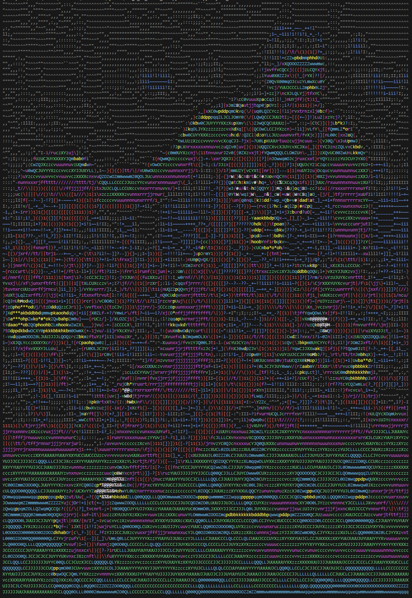
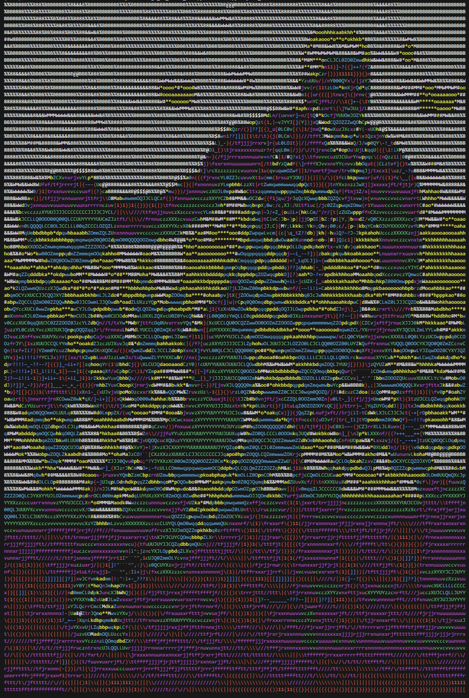

# Ascii-Art
# Description
A program that converts JPG files into colorful ASCII art in the terminal. Inspired by [Robert Heaton](https://robertheaton.com/2018/06/12/programming-projects-for-advanced-beginners-ascii-art/).

# Usage
Upload an image to the same directory as main.py  
Choose one of the filter names: `ave, min_max, lum`  
Choose normal or inverted option: `dark` (omit if you want normal version)  
Type in the terminal: `python main.py image_name filter_name (dark_optional)`  

### Notes:
- Do not include the image's file extension in image_name
- filter_name must be typed exactly the same as one of the given filter names (case sensitive)

# Examples: 

## Original Image

## Luminosity filter adjusts RGB brightness value based on human perception  
### Command: `python main.py Jayson_Tatum lum`  

## Luminosity filter with inverted colors  
### Command: `python main.py Jayson_Tatum lum dark`  
